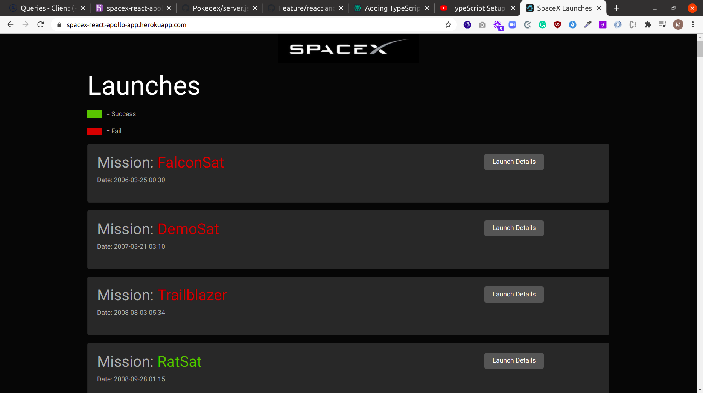

### spacex_launch_stats
An example of wrapping a REST API in GraphQL- coded for learning purposes by following this tutorial.

## Built With

- Javascript
- GraphQL

## Description

A graphQL example - coded for learning purposes by following this [tutorial](https://www.youtube.com/watch?v=SEMTj8w04Z8)

## Run server

`yarn install && yarn start`

## Authors

👤 **Marylene Sawyer**
- Github: [@Bluette1](https://github.com/Bluette1)
- Twitter: [@MaryleneSawyer](https://twitter.com/MaryleneSawyer)
- Linkedin: [Marylene Sawyer](https://www.linkedin.com/in/marylene-sawyer-b4ba1295/)

# Acknowledgements

- The content in this repository was retrieved from or inspired by the following sites
  - [GraphQL With React & Apollo [1] - Express GraphQL Server](https://www.youtube.com/watch?v=SEMTj8w04Z8)

## 🤝 Contributing

Contributions, issues and feature requests are welcome!